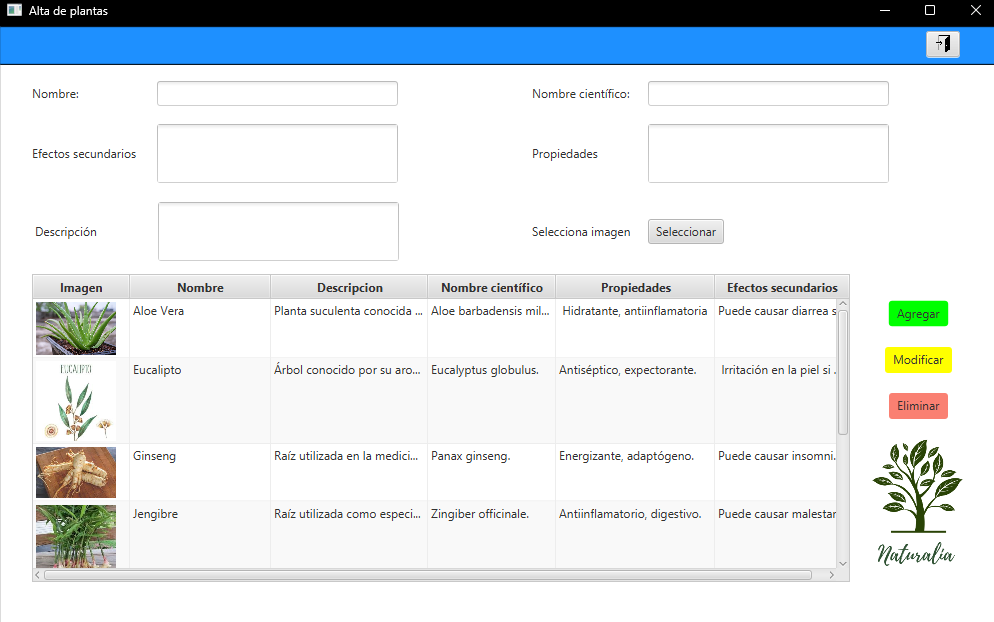

# Funcionalidades

## Agregar plantas
La aplicación permite agregar nuevas plantas a la base de datos. Esto se puede hacer   llenando los campos de "Nombre", "Nombre científico", "Descripción", "Propiedades" y "Efectos secundarios".

## Seleccionar imagen
Hay una opción de "Selecciona imagen" que permite asociar una imagen a la planta que se está agregando.

## Modificar información
Existe un botón "Modificar" que permite editar la información de una planta ya existente en la base de datos.

## Eliminar plantas
La aplicación cuenta con un botón "Eliminar" que permite eliminar una planta de la base de datos.

## Visualización de plantas
La parte inferior de la pantalla muestra una tabla con la información de las plantas   ya agregadas, incluyendo su imagen, nombre, descripción, nombre científico, propiedades y efectos secundarios.

En resumen, esta aplicación permite a los usuarios gestionar una base de datos de plantas,   agregando nuevas, modificando las existentes y eliminando las que ya no se necesiten, todo ello acompañado de información relevante sobre cada especie vegetal.