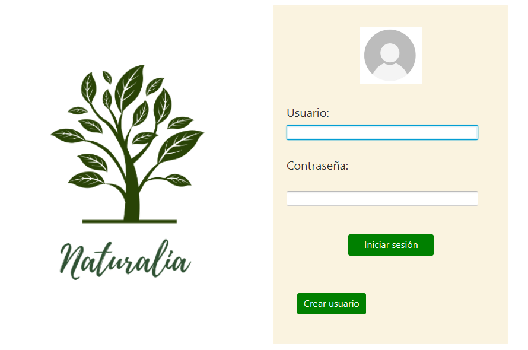

# Iniciar Sesión: Es el título principal del formulario.

## Formulario de Inicio de Sesión: Es un subtítulo que describe la sección.

- **Usuario:** [Campo de texto]: Representa un campo de entrada de texto para el nombre de usuario.

- **Contraseña:** [Campo de texto]: Representa un campo de entrada de texto para la contraseña.

### Botones: Subtítulo para la sección de botones.

- **Iniciar sesión**: Representa un botón para iniciar sesión.

- **Crear usuario**: Representa un botón para redirigir a la creación de un nuevo usuario.