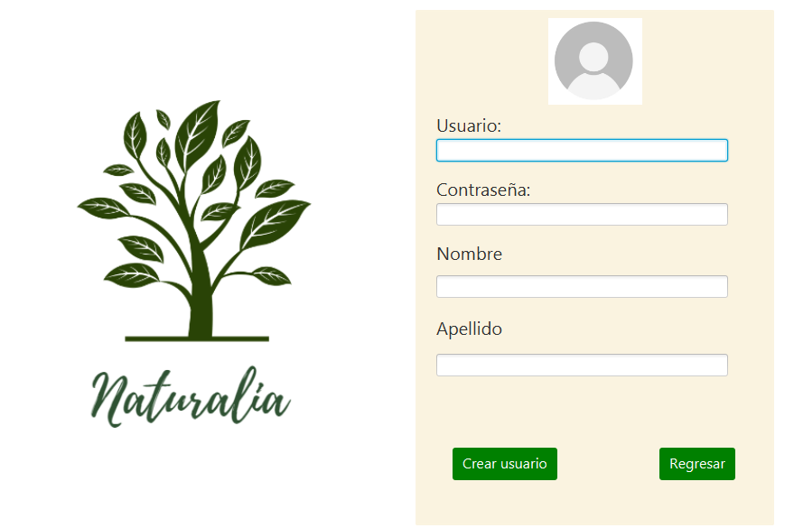

# Crear Usuario: Es el título principal del formulario.

## Formulario de Creación de Usuario: Es un subtítulo que describe la sección.

- **Usuario:** [Campo de texto]: Representa un campo de entrada de texto para el nombre de usuario.

- **Contraseña:** [Campo de texto]: Representa un campo de entrada de texto para la contraseña.

- **Nombre:** [Campo de texto]: Representa un campo de entrada de texto para el nombre.

- **Apellido:** [Campo de texto]: Representa un campo de entrada de texto para el apellido.

### Botones: Subtítulo para la sección de botones.

- **Crear usuario**: Representa un botón para crear el usuario.

- **Regresar**: Representa un botón para regresar a la pantalla anterior.