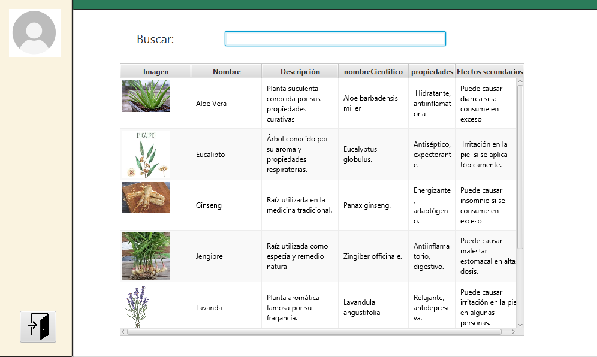

# Panel de Usuario

## Buscar:
[Campo de búsqueda]

### Tabla de Plantas

| Imagen      | Nombre      | Descripción                                      | Nombre Científico       | Propiedades                     | Efectos Secundarios                              |
|-------------|-------------|--------------------------------------------------|-------------------------|---------------------------------|--------------------------------------------------|
| Aloe Vera   | Planta suculenta conocida por sus propiedades curativas | Aloe barbadensis Miller | Hidratante, antiinflamatoria    | Puede causar diarrea si se consume en exceso     |
| Eucalipto   | Árbol conocido por su aroma y propiedades respiratorias | Eucalyptus globulus      | Antiséptico, expectorante       | Irritación en la piel si se aplica tópicamente   |
| Ginseng     | Raíz utilizada en la medicina tradicional              | Panax ginseng           | Energizante, adaptógeno         | Puede causar insomnio si se consume en exceso    |
| Jengibre    | Raíz utilizada como especia y remedio natural          | Zingiber officinale      | Antiinflamatorio, digestivo      | Puede causar malestar estomacal en alta dosis    |
| Lavanda     | Planta aromática famosa por su fragancia                | Lavandula angustifolia   | Relajante, antidepresiva         | Puede causar irritación en la piel en algunas personas |

### Botones
- **Agregar Planta** (Botón para agregar una nueva planta a la tabla)
- **Editar** (Botón para editar la información de una planta existente)
- **Eliminar** (Botón para eliminar una planta de la tabla)
- **Guardar Cambios** (Botón para guardar las modificaciones realizadas)